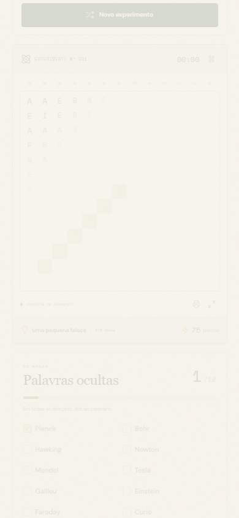
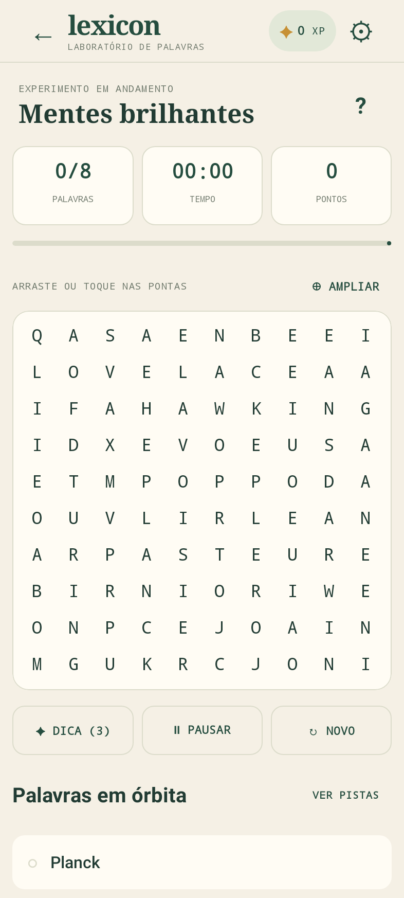

# Lexicon — Laboratório de Palavras

[Jogar online](https://danieltr048.github.io/lexicon/) · [Baixar para Android](https://danieltr048.github.io/lexicon/android/lexicon.apk)

Projeto pessoal de [DanielTR048](https://github.com/DanielTR048): um caça-palavras em português com estética de laboratório científico dos anos 1950/60. Versão web estática e aplicativo Android nativo em Kotlin/Jetpack Compose, sem conta, servidor de dados, API ou assinatura.

**42 temas · 756 palavras · 3 dificuldades · desafio diário · jogo offline**

| Web no celular | Android nativo |
| --- | --- |
|  |  |

A web usa JavaScript, CSS, Vite e service worker. O Android usa Kotlin, Jetpack Compose e armazenamento local. As duas versões incluem dicas, favoritos, XP, conquistas e um caderno de descobertas.

## Jogar no Windows

Clique duas vezes em **INICIAR.cmd** e mantenha a janela aberta. O jogo abre em **http://127.0.0.1:4184**. Se o servidor já estiver rodando nessa porta, basta abrir esse endereço.

Requisito: Node.js 20.19+ ou 22.12+. Na primeira instalação, o iniciador baixa as dependências com `npm ci` e gera a versão de produção. Depois disso, os arquivos do jogo ficam disponíveis localmente.

```powershell
npm ci
npm run build
npm run preview -- --port 4184
```

Depois da primeira carga completa da versão de produção, o service worker guarda a aplicação, as fontes e a ilustração para uso offline no mesmo navegador. O servidor local continua sendo a forma recomendada de iniciar. Abrir `index.html` com `file://` não executa o projeto. Não há sincronização entre dispositivos; limpar os dados do site remove o progresso. Cada endereço/porta possui seu próprio salvamento.

## Jogar no Android

O aplicativo nativo está em `android-native/` e funciona em **Android 8.0 ou superior**. Os 42 temas, as 756 palavras e a ilustração são incluídos no APK: depois de instalado, a primeira partida já pode começar sem internet. O aplicativo oferece desafio diário, três dificuldades, dicas, XP, conquistas, favoritos, caderno, sons opcionais, resposta tátil e redução de movimento. Temas personalizados e impressão estão disponíveis na versão web; ainda não estão no aplicativo Android.

Para gerar o APK assinado no Windows, a partir desta pasta:

```powershell
npm run android:sync
.\android-native\BUILD-ANDROID.ps1 -Release
```

O script sincroniza os recursos novamente, executa testes e lint e, se tudo passar, grava `output/Lexicon-Android-release.apk`. Transfira esse arquivo para o celular e abra-o para confirmar a instalação pelo Android. O aplicativo não é instalado automaticamente ao visitar o site. Veja [a configuração de build, assinatura e CI](android-native/README.md).

O progresso do Android fica no armazenamento local do aplicativo. Ele é independente do progresso do navegador: não há migração ou sincronização entre as duas versões. Remover os dados do aplicativo apaga seu progresso local.

Também é possível instalar a **versão web** pelo navegador Android. O cartão no site oferece o botão de instalação quando o navegador disponibiliza o prompt; nos demais casos, mostra como usar o menu do navegador. A confirmação é sempre do usuário. A mensagem **“Pronto para jogar offline neste aparelho”** só aparece depois que o service worker verifica todos os arquivos necessários no cache. Esse preparo exige uma primeira visita completa com internet. O cartão desaparece no modo instalado e pode ser fechado durante a sessão.

## GitHub Pages e download do APK

O build em `dist/` usa caminhos relativos e funciona tanto na raiz quanto em um subdiretório, como `https://usuario.github.io/lexicon/`. O manifesto, a ilustração, os ícones Android e o cache offline acompanham esse diretório. Cada escopo mantém seu próprio cache.

Este repositório público apresenta o projeto pessoal e seus fontes; a hospedagem principal é o GitHub Pages. O workflow `.github/workflows/pages.yml` publica o site **manualmente**: instala dependências, executa os testes unitários, gera o build e publica o artefato. O Pages usa **Settings → Pages → Source → GitHub Actions**. Para publicar uma atualização, execute o workflow. Não há publicação na Play Store.

O APK assinado está em `public/android/lexicon.apk`; `.env.production` configura o botão **“Baixar Android”** para esse arquivo. Para usar outro endereço, altere `VITE_ANDROID_APK_URL` antes do build. No workflow de Pages, a variável **`LEXICON_ANDROID_APK_URL`** permite sobrescrever esse endereço. O APK não integra o cache da versão web; o download começa apenas quando o usuário toca no link.

A hospedagem principal é o **GitHub Pages**, com acesso público em https://danieltr048.github.io/lexicon/ e download direto do aplicativo Android nativo em https://danieltr048.github.io/lexicon/android/lexicon.apk . A publicação anterior no Sites mantém sua identidade em `.openai/hosting.json` e pode ser atualizada pelo helper do plugin. Credenciais, chaves de assinatura e arquivos locais de compilação ficam fora do controle de versão. Após gerar um novo APK, execute `npm run package:mobile` para atualizar a cópia distribuída no site, envie `public/android/lexicon.apk` ao repositório e execute o workflow de Pages.

Para gerar o pacote web com download do APK já compilado: `npm run package:mobile`. O resultado em `dist/` contém o site e `android/lexicon.apk`; o navegador só baixa o APK quando a pessoa toca em **Baixar Android**. O cache offline do jogo não baixa esse arquivo automaticamente.

```powershell
$env:VITE_ANDROID_APK_URL = 'https://seu-endereco/lexicon-android.apk'
npm run build
Remove-Item Env:VITE_ANDROID_APK_URL
```

## Conteúdo incluído

- **42 temas e 756 palavras com pistas**, divididos em 6 categorias: ciência e natureza, ficção e universos, história e épocas, filosofia e ideias, política e sociedade, cultura e artes.
- Heróis Marvel e DC, vilões, Star Wars, Terra-média e magia; Egito, Grécia, Roma, Idade Média, Renascimento e Brasil; filósofos, ética, lógica, escolas do pensamento; cientistas, astronomia, química, genética, corpo humano, ecologia e matemática; democracia, Estado, ideias políticas, lideranças históricas, sociedade e economia; literatura, arte, música, cinema, mitologia e linguagem.
- Três dificuldades: **Aprendiz** (10×10, 8 palavras), **Pesquisador** (13×13, 12 palavras) e **Gênio** (16×16, 16 palavras).
- Novo tabuleiro a cada experimento, com geração determinística por semente e garantia de colocar todas as palavras selecionadas.
- Mouse, arrasto, toque nas duas pontas e teclado. Acentos, espaços e hífens são normalizados apenas no tabuleiro; os nomes originais aparecem na lista.
- Três dicas, cronômetro com pausa, pontuação, efeitos sonoros opcionais e modo de tabuleiro ampliado.
- Desafio diário igual para todos que usem a mesma data local e a mesma versão da biblioteca. Bônus diário concedido uma vez por data.
- Progresso salvo automaticamente, XP, oito conquistas, histórico, sequência diária e caderno de descobertas.
- Pesquisa de temas, filtro de categoria, favoritos e criação de temas próprios com 8 a 30 palavras.
- Impressão do tabuleiro sem as marcações das respostas.
- Layout para computador e celular; fontes locais, ilustração original, suporte a movimento reduzido e navegação por teclado.
- Laboratório animado: ilustração flutuante, átomo em órbita, respostas ao passar o cursor, escrita progressiva, entrada das letras em cascata, prévia da seleção, faíscas e pontos nos acertos, tremor breve nos erros e confetes ao concluir. Os efeitos respeitam movimento reduzido, são descartados ao trocar de tela e não bloqueiam novas respostas.

## Regras

Arraste da primeira à última letra ou toque nas duas pontas. As palavras são linhas retas. Aprendiz usa direita, baixo e diagonal baixo-direita; os demais níveis usam oito direções. A seleção em sentido inverso também é aceita. Ocorrências adicionais legítimas formadas pelas letras de preenchimento também contam.

Cada palavra vale 50, 75 ou 100 pontos, conforme a dificuldade. Uma dica revela a primeira letra de uma palavra ainda não encontrada e desconta até 25 pontos, sem tornar a pontuação negativa. As dicas priorizam palavras diferentes; quando as restantes já receberam uma dica, revelam a última letra. O destaque da dica é preservado ao recarregar. Ao concluir, a pontuação vira XP e cada dica não usada acrescenta 25 XP. O desafio diário adiciona 150 XP. O tempo é informativo e não reduz a pontuação.

O cronômetro começa na primeira interação com o tabuleiro ou dica. Pausa ao abrir um diálogo, sair da aba, navegar para outro painel ou usar o botão de pausa. O progresso é salvo a cada descoberta/ação e a cada cinco segundos de jogo.

No teclado: Tab entra no tabuleiro, setas mudam a célula, Enter ou espaço marcam início/fim, Esc cancela. No arquivo de temas, `/` foca a busca.

Temas próprios escolhem apenas termos que caibam no tabuleiro. Se houver menos palavras aptas do que o limite de uma dificuldade, a partida utiliza todas as aptas; são necessárias ao menos quatro. O último tema personalizado é salvo junto com sua partida.

## Desenvolvimento e validação

Entrega local validada em 03/10/2026: **50 testes web e 28 testes Android passaram**. O APK release foi compilado, assinado e verificado; o lint Android terminou com zero erros. Os testes nativos executaram Compose em um runtime Android local (Robolectric), com capturas de tela, toque, arraste e retomada do salvamento. Vibração, áudio e instalação em aparelho físico ainda precisam dessa verificação no dispositivo.

Artefatos em `output/`: `Lexicon-Android-release.apk` (3.449.690 bytes), `Lexicon-Site.zip` (site com download Android), `android-home.png`, `android-game.png` e `android-download.png`. O download pelo botão do site foi conferido por SHA-256 e não acontece automaticamente ao abrir a página.

```powershell
npm run dev -- --port 5184
npm test
npm run build
npx playwright install chromium
npm run test:e2e
```

A suíte E2E inicia automaticamente o servidor de desenvolvimento na porta 5184 e a versão de produção na porta 4184, ou reutiliza os servidores que já estiverem nessas portas. Se a versão de produção já estiver rodando, execute `npm run build` antes de testar alterações recentes. `npx playwright install chromium` só é necessário para preparar o navegador dos testes.

- `src/main.js`: interface, partidas, interações, pontuação e conquistas.
- `src/engine.js`: geração por semente, normalização e validação de seleção.
- `src/data.js`: biblioteca editorial dos temas e pistas.
- `src/storage.js`: armazenamento defensivo e calendário diário.
- `src/style.css`: direção visual e layouts responsivos.
- `src/motion.js` e `src/motion.css`: animações, reações do jogo e redução de movimento.
- `src/install.js` e `src/install.css`: instalação pelo navegador e confirmação do cache offline.
- `vite.config.js`: build relativo e cache offline versionado por conteúdo e escopo.
- `android-native/`: aplicativo Android nativo, regras, persistência, interface e testes.
- `scripts/sync-android-assets.mjs`: copia o catálogo e a ilustração da web para o Android.
- `.github/workflows/`: publicação web e validação/build de prévia Android.
- `tests/`: regras, integridade dos temas, persistência e testes reais no navegador.
- `output/`: capturas de validação em desktop e celular.
- `public/images/lab-genius.png`: ilustração original; prompt e origem em `ASSET_NOTES.txt`.

Os testes PWA também exercitam hospedagem em subdiretório, recarga offline com parâmetros na URL, isolamento de caches, confirmação/cancelamento de instalação e verificação real dos recursos offline. A interface de confirmação do sistema operacional e a experiência em aparelhos físicos exigem validação no dispositivo.

Personagens e universos são referências editoriais aos seus respectivos titulares. O conteúdo político e histórico usa pistas descritivas e não implica endosso a pessoas ou ideologias.
